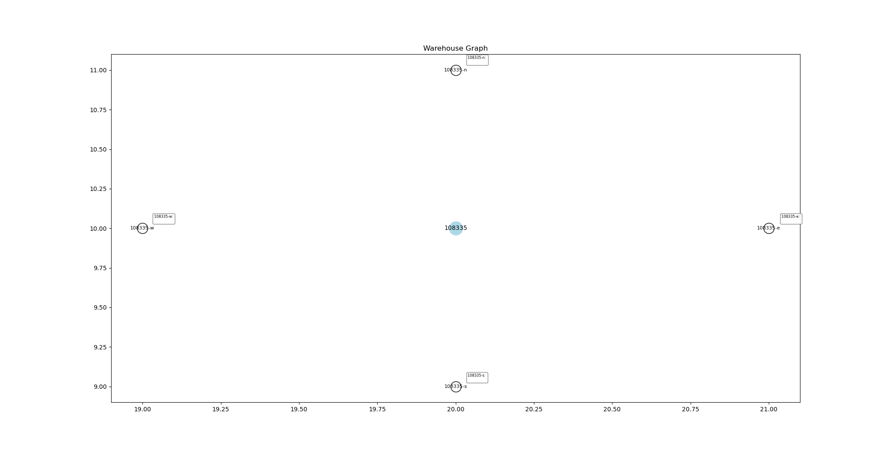
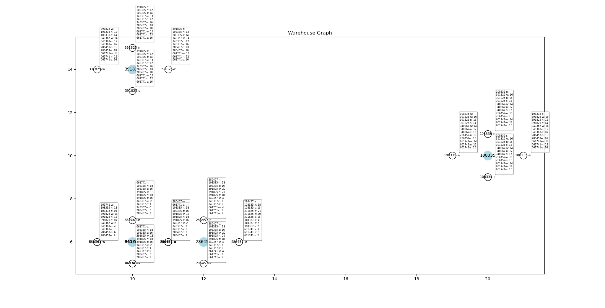
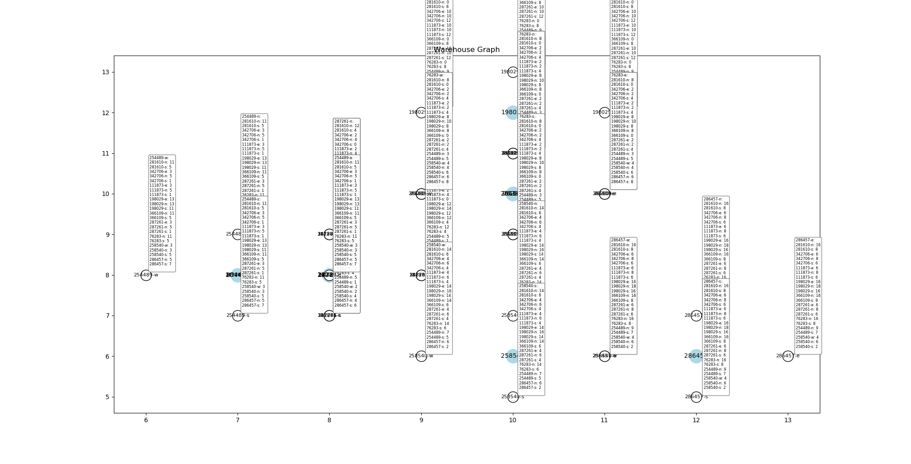
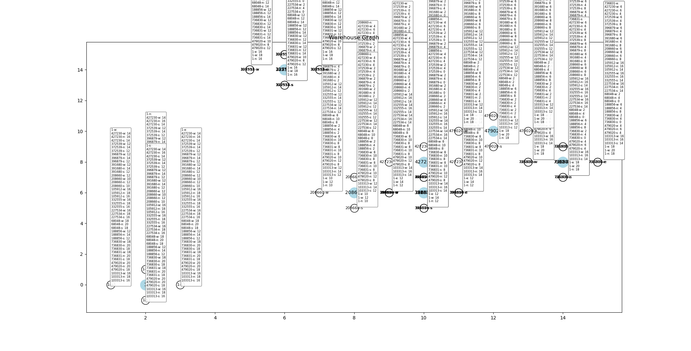
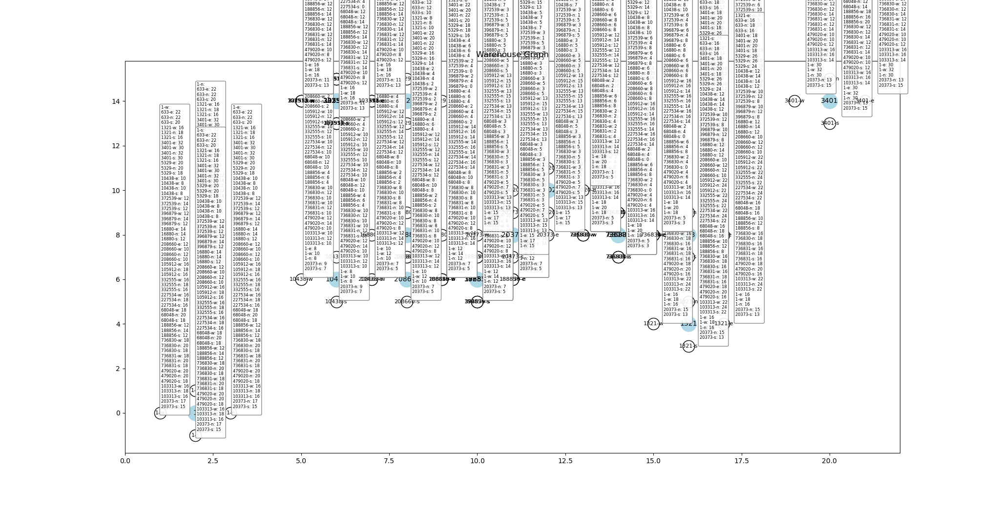

# Benchmarks on test inputs
This document describes the setup and inputs used during tests, as well as the result of each test case. 

# Test Setup
## Hardware Setup
- CPU: Intel(R) Core(TM) i7-6700 CPU @ 3.40GHz
- RAM: 15.5GiB

## Software Setup
- Operating System: Arch Linux (Kernel 6.3.3)
- Python: 3.11.3

# Test Procedure
1. The script reads test cases (order lists). 
2. Initiate the algorithm. The computation time is recorded and measured with Python's `timeit` module. Peak memory usage is measured with the `memory_profiler` module, which requires manual installation. 

# Test Cases

1. Size 1: 108335
2. Size 5: 108335, 391825, 340367, 286457, 661741
3. Size 10: 281610, 342706, 111873, 198029, 366109, 287261, 76283, 254489, 258540, 286457
4. Size 15: 427230, 372539, 396879, 391680, 208660, 105912, 332555, 227534, 68048, 188856, 736830, 736831, 479020, 103313, 1
5. Size 20: 633, 1321, 3401, 5329, 10438, 372539, 396879, 16880, 208660, 105912, 332555, 227534, 68048, 188856, 736830, 736831, 479020, 103313, 1, 20373

# Test Results

| Size | B&B    | Nearest Neighbor |
| ---- | ------ | ---------------- |
| 1    | 0.034s | 0.033s           |
| 2    | 0.053s | 0.046s           |
| 3    | 0.061s | 0.038s           |
| 4    | 0.255s | 0.060s           |
| 5    | 0.661s | 0.098s           |

Peak memory usage: 46952 KiB (45.85 MiB)

Note: Nearest Neighbor algorithm does not necessarily produce the optimal route, however it can easily meet the 15-seconds time constraint of the application. 

# Test Case Reference Graph

